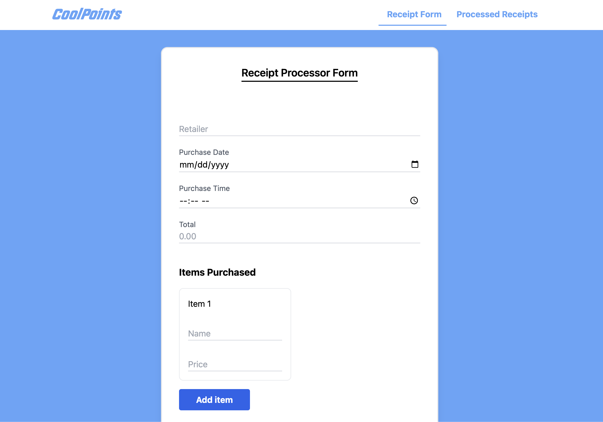
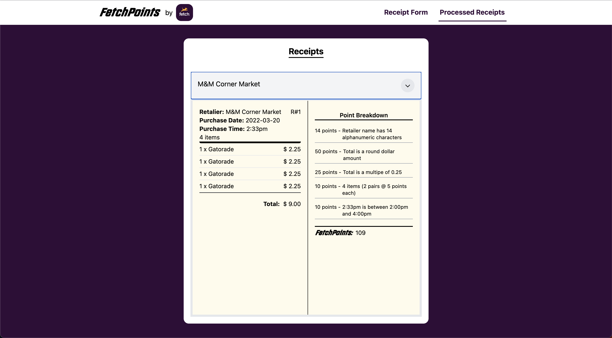

# Receipt Processor Front-end

Hey Launch Scout Team! Welcome to Receipt Processor Frontend. This project was built with Docker and React and beautifully styled with the TailwindCSS library.

## Getting Started

These instructions will get you a copy of the project up and running on your local machine.

### Prerequisites

The only prerequisite is to have Docker installed on your machine.

### Instatlling

1. Clone the repository to your local machine using Git:

```
git clone https://github.com/jayastronomic/launch-scout-project-client
```

2. Install the project dependencies by running the following command in the project's root directory:

```
docker compose up
```

This command will build the docker image and run the cointaner for this project. The container is set to listen on "http://localhost:3000"

3. Once you visit http//:localhost:3000, yow will see the landing page of the client:

[Receipt Processor Form](./src/assets/home.png)



Here is a form for you to fill out to add receipt information. It takes all of the information and processes the points you get for each submission. To see the points you get for each receipt, click the link called "Processed Receipts". The link takes you to a page to see all of the receipt information that has been processed by the backend. You will also see the acquired points for each receipt based on the rules of the backend.

[Receipt Information](./src/assets/info.png)



## Authors

- **Julian Smith** - _Initial work_ - [jayastronomic](https://github.com/jayastronomic)
