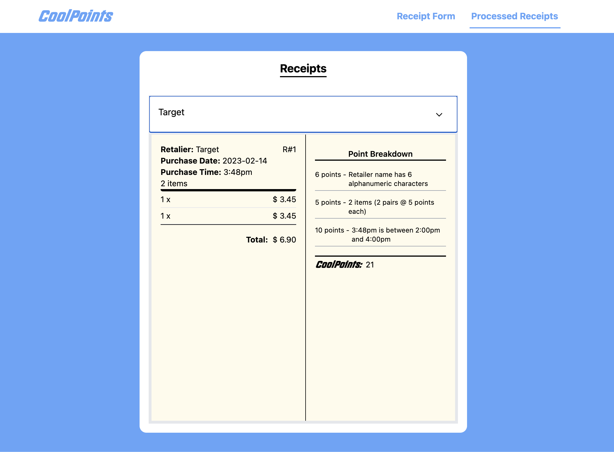

# BONUS Receipt Processor Front-end

Hey Fetch Rewards Team! Welcome to Receipt Processor Frontend. This project was built with Docker and React and beuatifully styled with the TailwindCSS library. I styled it based on the of Fetch Rewards!

## Getting Started

These instructions will get you a copy of the project up and running on your local machine.

### Prerequisites

There are no prequisites for thus project since Docker is installed on Fetch Rewards systems.

### Instatlling

1. Clone the repository to your local machine using Git:

```
git clone https://github.com/jayastronomic/fetch-frontend-bonus.git
```

2. Install the project dependencies by running the following command in the project's root directory:

```
docker compose up
```

This command will build the docker image and run the cointaner for this project. The container is set to listen on "http://localhost:3000"

3. Once you visit http//:localhost:3000, yow will see the landing page of the client:

[Receipt Processor Form](./src/assets/home.png)


Here is a form for you to fill out to add receipt information. It takes all of the information and processes the points you get for each submission. To see the points you get for each receipt, click the link called "Processed Receipts". The link takes you to a page to see all of the receipt information that has been processed by the backend. You will alsosee the acquired points for each receipt based on the rules of the challenge:

[Receipt Information](./src/assets/info.png)



Cool, right? I figured it'll be nice for you guys to see it in action in a more interactive way. I hope you guys enjoyed looking at my submission for this challenge and the bonus as well!

## Authors

- **Julian Smith** - _Initial work_ - [jayastronomic](https://github.com/jayastronomic)
